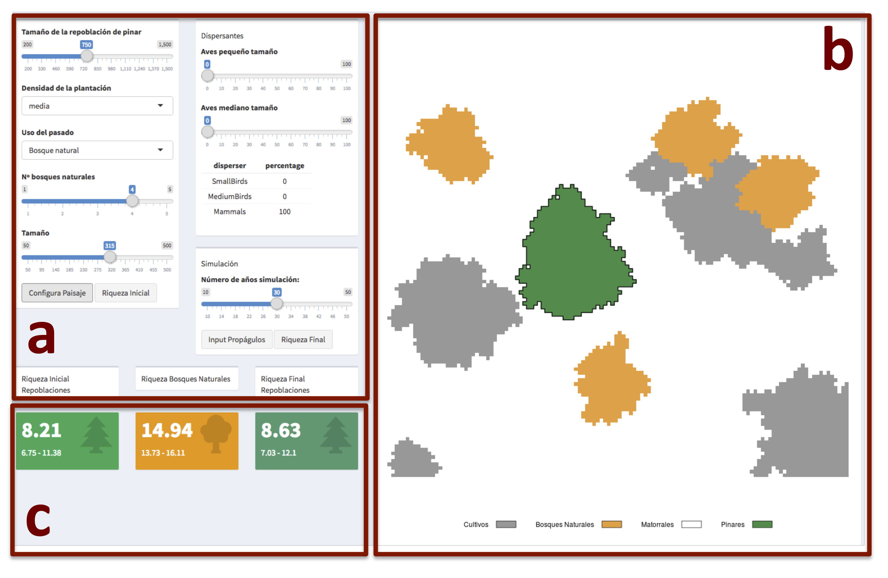
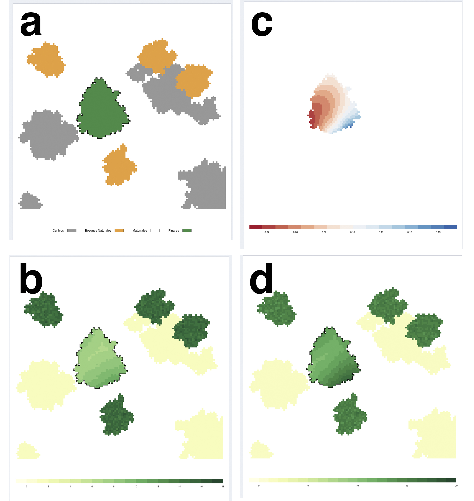

## Autores
**Antonio J. Pérez-Luque; Regino Zamora**

Laboratorio de Ecología. Centro Andaluz de Medio Ambiente

Departamento de Ecología. Universidad de Granada 

# Resumen 

Los ecosistemas con mayor diversidad de especies son potencialmente mas resilientes ante alguna perturbación. Los pinares de repoblación son ecosistemas muy homogéneos con baja diversidad de especies, dificultando su capacidad de respuesta a eventos extremos. 

Las acciones de gestión en los pinares de repoblación han de ir encaminadas a aumentar la diversidad de tipos funcionales de especies y su heterogeneidad espacial, para así aumentar su resiliencia.

En este trabajo presentamos una aplicación interactiva que muestra como varía la diversidad de especies (y por ende la resiliencia) en los pinares de repoblación en funcion de: la configuración del paisaje; la estructura interna y la composición de los vectores de dispersión. 

Con esta aplicación se pretende ayudar a los usuarios a entender las acciones de gestión forestal que se pueden aplicar para mejorar la resiliencia de estos ecosistemas, así como visualizar algunos de los complejos mecanismos ecológicos que operan en los ecosistemas mediterráneos. 

# Palabras clave 
pinares de repoblación; resiliencia; simulación; cambio global; transferencia; divulgación

# Abstract 
Ecosystems with high levels of species diversity are potentially more resilient to disturbances. Pine plantations are ecosystems with low diversity and homogeneous structure, hindering their adaptation capacity to extreme events. 

Management actions should be aimed to increase the species and functional diversity and also the spatial heterogeneity, in order to improve the resilience of this ecosystems. 

We presenta an interactive application that aims to show how the species diversity (and therefore resilience) varies in the pine plantations based on: landscape configuration; internal structure, and composition of the dispersal vectors.

This application helps to understand the management actions that could be applied to improve the resilience of these ecosystems, and to visualize some of the complex ecological mechanisms that operate in Mediterranean ecosystems 

# Keywords 

pine plantations; resilience; simulation; global change; knowledge transference

# Introducción 

Los pinares de repoblación en ambientes mediterráneos, implantados en su mayoría durante la segunda mitad del siglo XX, se caracterizan por ser ecosistemas muy homogéneos, con altas densidades arbóreas y poca diversidad de especies. Estas características dificultan la capacidad de respuesta de estos ecosistemas a enventos extremos (como por ejemplo sequías). El aumento en la frecuencia de los eventos extremos que predicen los escenarios climáticos puede provocar una reducción en la resiliencia de los ecosistemas, es decir, en la capacidad para recuperar sus propiedades tras una perturbación. 

Los ecosistemas con mayor diversidad de especies son potencialmente mas resilientes ante alguna perturbación. Por tanto las acciones de gestión en los pinares de repoblación han de ir encaminadas a aumentar la diversidad de tipos funcionales de especies y su heterogeneidad espacial, para así aumentar su resiliencia. 

En este trabajo presentamos un aplicación interactiva titulada ***ResPine*** (*Resilience of Pine plantations*) creada para mostrar como la diversidad de especies presentes en los pinares de repoblación varía en función de la configuración del paisaje; estructura interna de la repoblación (usos del suelo en el pasado, densidad de árboles), y la composición de los vectores de dispersión (aves, mamíferos). 

El objetivo de la aplicación es ayudar a entender las acciones de gestión forestal que se pueden aplicar para mejorar la resiliencia de estos ecosistemas, así como visualizar algunos de los complejos mecanismos ecológicos que operan en los ecosistemas mediterráneos. Además es una forma de transferir conocimiento científico generado por grupos de investigación a la sociedad de una forma divulgativa.

# Respine

***ResPine*** (*Resilience of Pine plantations*) es una aplicación construida utilizando el lenguaje de programación R [@r2017] y la tecnología Shiny [@shiny2017]. Se basa en la simulación del comportamiento de diferentes modulos (pinares de repoblación, vectores de dispersion, paisaje, etc.) en relación a la diversidad de especies presentes en una repoblación de pinar. Se han construido funciones específicas en R, basadas en los resultados obtenidos en diversos trabajos de investigación sobre naturalización de pinares y ecología del paisaje, llevados a cabo princiapalmente en Sierra Nevada (Gómez-Aparicio et al. 2009, Matías et al. 2010, Zamora et al. 2010, González-Moreno et al. 2011, Navarro-González et al. 2013), que modelizan como cada variable de interés afecta a la diversidad de especies. 

La aplicación está formada por tres módulos conceptuales que muestran como varía la riqueza de especies en los pinares de repoblación en función de: 

* la estructura interna de la repoblación (usos del suelo en el pasado, densidad de árboles)
* la configuración del paisaje
* composición de los vectores de dispersión (aves, mamíferos) 

El usario puede modificar los parámetros de las variables que componen estos módulos y ver como afectan a la diversidad de especies en un pinar de repoblación. El resultado de las simulaciones realizadas con los parámetros elegidos se visualizan de forma espacializada (Figura 1)

# Modulos

## Estructura interna de la repoblación

En este módulo el usuario tiene que especificar diferentes aspectos relacionados con la estructura interna de la repoblación, la cual influye en la riqueza y diversidad de especies que estos ecosistemas pueden albergar [@GomezAparicio2009; @Gonzalez2011; @Navarro2013]. 

### Densidad de la repoblación
La densidad de la repoblación tiene un efecto negativo en la diversidad y en la riqueza total de especies que encontramos bajo pinares de repoblación, decreciendo éstas al aumentar la densidad de la plantación [@GomezAparicio2009]. Una mayor densidad arbórea implica que entre menos luz, y por tanto menor diversidad de especies vegetales. Además, en los pinares muy densos, el flujo de entrada de semillas se ve obstaculizado tanto para las especies de dispersión por viento como para las dispersadas por las aves. Los arrendajos, por ejemplo, prefieren visitar zonas menos densas [@Gomez2003]. 

El usuario elige entre tres tipos de densidades dentro del pinar de repoblación: baja (< 500 pies / ha), media (500 - 1500 pies /ha) y alta (> 1500 pies / ha), que afectarán a la diversidad de especies que se observa dentro de un pinar de repoblación [@GomezAparicio2009]. 

### Uso del pasado 
Muchas repoblaciones se realizaron sobre suelos que antiguamente fueron campos de cultivo, pastos, matorrales o bosques naturales manejados. El uso que tuvo el suelo en el pasado condiciona la riqueza de especies que encontramos en un pinar de repoblación [@Navarro2013]. La cantidad de reclutas de especies de *Quercus* sp. que encontramos en un pinar de repoblación depende del uso del suelo previo a la repoblación y de la distancia a la fuente semillera. Existe un gradiente de intensidad de uso, así cuanto mas inteso fuera el uso del pasado antes de la repoblación forestal, menor probabilidad de encontrar reclutas de especies de *Quercus* sp. en la actualidad [@Navarro2013].

En este modulo el usuario puede elegir la intensidad de uso antrópico antes de que se estableciera la repoblación de pinar. El gradiente de uso (de mayor a menor intensidad de uso antrópico) es: cultivo, pastizal, matorral y bosque natural. 

# Configuración del paisaje 

La configuración del paisaje condiciona el funcionamiento de algunos procesos ecológicos. La riqueza de especies bajo los pinares de repoblación varía en función de la cantidad de manchas de vegetación natural (fuente semillara) y de la distancia a las mismas [@Gonzalez2011]. Así, a mayor número de parches de bosques naturales, más probabilidad de que lleguen propágulos de especies nativas a dichas repoblaciones. Por otro lado, la cantidad y diversidad de semillas que aporta una fuente semillera, depende de su tamaño y composición específica. 

La distancia a la fuente semillera afecta al proceso de dispersión de semillas [@Hewitt2002]. Distancias mas cortas a los parches de vegetación natural incrementan la probabilidad de que entren propágulos en la repoblación de pinar [@Gonzalez2011; @GomezAparicio2009]. El grado de adyacencia de las manchas de vetegación natural afecta igualmente a la cantidad de semillas introducidas dentro de la repoblación de pinar [@Zamora2010], de forma que cuanto mayor adyacencia, mayor entrada de semillas y mayor probabilidad de que se establezcan nuevas especies en los pinares de repoblación. 

El usuario elige el tamaño y el número de los parches de vegetación natural, y la aplicación genera de forma aleatoria una distribución de las diferentes manchas de vegetación en torno a la repoblación de pinar. Los valores de diversidad de especies existentes en la fuente semillera se establecen basándose en datos procedentes de inventarios forestales (SINFONEVADA; [@PerezLuque2014]). 

# Vectores de dispersión 

La composición de la comunidad de dispersantes condiciona la entrada de propágulos a las repoblaciones de pinar. Cada animal tiene un comportamiento dispersor diferente (tipo de semillas que dispersan, distancia a la cual dispersa, preferencia por sitios donde dispersar, etc). 

En este modulo se han establecido tres grupos de vectores de dispersión, caracterizados principalmente por la distancia de dispersión y por la cantidad y cualidad de las semillas que dispersan: 

* *Aves de pequeño tamaño* cuyo pico máximo de dispersión está entre 0 y 50 metros, y raramente pasan de 100 metros [@Jordano2007 @Zamora2010]
* *Aves de mediano tamaño*, que dispersan el 50 % de las semillas a distancias superiores a los 100 m. En este grupo se pueden incluir los arrendajos que presentan distancias de dispersión de hasta 1000 metros [@Gomez2003 @Pons2007], y su máximo de dispersión se sitúa a una distancia de entre 250 y 400 metros, aunque es muy dependiente del paisaje [@Gomez2003]
* *Mamímeros* cuyos patrones de dispersión son muy variables, pero dispersan a mayores distancias (incluso mas de 1500 metros). Presentan máximos de dispersión en torno a 650 - 700 m, y además pueden introducir semillas alóctonas debido a sus grandes distancias de dispersión [@Jordano2007 @Matias2010]. 

Los patrones y distancias de dispersión se han establecido en base a trabajos realizados principalmente en la zona de estudio [@Gomez2003 @Matias2010 @Zamora2010 @Jordano2007]. 

El usuario determina el porcentaje de cada uno de los grupos de dispersión y se lleva a cabo una simulación de la cantidad de propágulos que potencialmente pueden introducirse en la repoblación de pinar en un año. 

# Funcionamiento 

En primer lugar el usuario determina las características del pinar de repoblación objetivo. Se decide el tamaño, la densidad de plantación y el uso que tuvo en el pasado (Figura 2a). Posteriormente se configura el paisaje determinando el número y tamaño de manchas de bosque natural presente (Figura 2b). A continuación la aplicación genera un paisaje con las características especificadas por el usuario (Figura 3a) y computa el valor de diversidad inicial tanto en los parches de vegetación natural como en la repoblación de pinar. Estos valores se expresan de forma numérica (Figura 1c) y también se pueden visualizar espacialmente (Figura 3b).

El siguiente paso es configurar la composición de la comunidad de dispersantes, donde se elige el porcentaje de cada uno de los grupos de dispersión (Figura 2c). Con estos datos se computa la cantidad de propágulos que pueden entrar en un año en la repoblación de pinar, teniendo en cuenta todas las características anteriores especificadas por el usuario. El resultado se puede visualizar de forma espacial (Figura 3c). Finalmente se especifican los años de simulación y se puede visualizar la riqueza final en el pinar de repoblación (Figura 3d). 

# Discusión
Esta aplicación muestra como varía la diversidad de especies presentes en los pinares de repoblación en función de la configuración del paisaje, la estructura interna de la repoblación y la composición de los vectores de dispersión. Con su carácter demostrativo, ayuda a visualizar situaciones en los cuales las acciones de gestión forestal pueden ayudan a incrementar la diversidad en un pinar de repoblación.

Por otro lado supone una forma de transferencia de conocimiento científico generado durante varias décadas tanto a la gestión forestal como a la sociedad. 

Esta aplicación se ha generado en el marco del proyecto **LIFE-ADAPTAMED** (LIFE14 CCA/ES/000612): *Protección de servicios ecosistémicos clave amenazadas por el camibo climático mediente gestión adaptativa de socioecosistemas mediterráneos*. 

# Referencias 